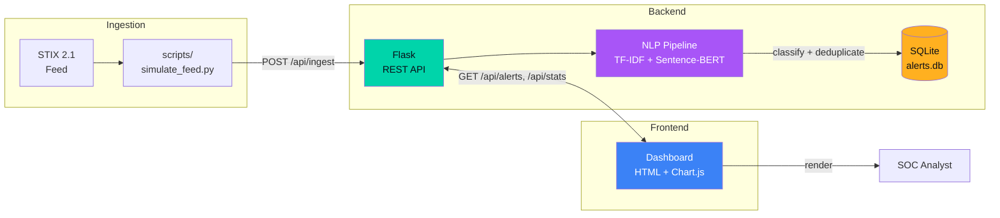

# SOC Threat Dashboard

A Flask-based SOC threat analysis dashboard with STIX 2.1 feed processing, NLP-driven alert classification, and real-time deduplication. Built with a dark navy theme, green/amber accents, and Chart.js visualizations.

## Architecture



## Quick Start

### Docker

```bash
# Build and start
docker compose up --build -d

# Populate the database with sample STIX data
docker compose exec dashboard python scripts/simulate_feed.py

# Open dashboard
open http://localhost:5000
```

### Local

```bash
# Create virtual environment
python -m venv .venv
source .venv/bin/activate   # Windows: .venv\Scripts\activate

# Install dependencies
pip install -r requirements.txt

# Generate sample STIX feed (optional — already provided)
python data/simulate_stix_feed.py

# Train NLP models
jupyter nbconvert --to notebook --execute notebooks/01_NLP_Experiments.ipynb

# Start the server
python run.py

# In another terminal, populate the database
python scripts/simulate_feed.py

# Open http://localhost:5000
```

## API Reference

| Method | Endpoint | Description |
|--------|----------|-------------|
| `GET` | `/` | Dashboard HTML |
| `GET` | `/api/alerts` | List alerts (paginated, filterable) |
| `POST` | `/api/ingest` | Ingest STIX 2.1 bundles |
| `GET` | `/api/stats` | Dashboard statistics |
| `GET` | `/api/alert/<id>` | Alert detail with NLP features |

### GET /api/alerts

Query parameters:

| Param | Type | Default | Description |
|-------|------|---------|-------------|
| `tactic` | string | — | Filter by tactic category |
| `duplicate` | int | — | `0` for unique, `1` for duplicates |
| `search` | string | — | Substring search in alert text |
| `date_from` | string | — | ISO date lower bound (e.g. `2026-05-01`) |
| `date_to` | string | — | ISO date upper bound |
| `page` | int | `1` | Page number |
| `limit` | int | `50` | Results per page |

Response (200):

```json
{
  "data": [
    {
      "alert_id": "indicator--abc123",
      "timestamp": "2026-06-01T12:00:00+00:00",
      "raw_text": "Detected outbound traffic to C2...",
      "tactic_category": "command-and-control",
      "confidence_score": 0.92,
      "is_duplicate": 0
    }
  ],
  "page": 1,
  "limit": 50,
  "total": 142
}
```

### POST /api/ingest

Request body: single STIX 2.1 bundle object or array of bundles.

Response (201):

```json
{
  "ingested": 5,
  "duplicates": 2,
  "errors": 0,
  "total": 5,
  "alerts": [...]
}
```

### GET /api/stats

Response (200):

```json
{
  "tactic_distribution": {
    "command-and-control": 15,
    "initial-access": 12,
    ...
  },
  "duplicate_rate": 0.14,
  "daily_volume": {
    "2026-05-25": 23,
    "2026-05-26": 18,
    ...
  }
}
```

### GET /api/alert/<alert_id>

Response (200):

```json
{
  "alert_id": "indicator--abc123",
  "timestamp": "2026-06-01T12:00:00+00:00",
  "raw_text": "Detected outbound traffic to C2...",
  "tactic_category": "command-and-control",
  "confidence_score": 0.92,
  "is_duplicate": 0,
  "top_features": [
    {"feature": "c2 traffic", "weight": 1.845},
    {"feature": "port 443", "weight": 1.203},
    {"feature": "outbound", "weight": 0.987}
  ]
}
```

## Project Structure

```
SOC-threat-dashboard/
├── app/
│   ├── __init__.py              # Flask app factory
│   ├── models.py                # SQLite layer (raw sqlite3)
│   ├── routes.py                # REST API routes
│   ├── nlp/
│   │   ├── __init__.py          # NLP blueprint
│   │   ├── classifier.py        # TF-IDF + Sentence-BERT classifiers
│   │   ├── deduplication.py     # Cosine-similarity dedup
│   │   └── embeddings.py        # Sentence-transformer helpers
│   └── templates/
│       └── dashboard.html       # SOC dashboard UI
├── static/
│   └── js/
│       └── charts.js            # Chart.js + API fetch logic
├── data/
│   ├── simulate_stix_feed.py    # STIX 2.1 bundle generator
│   └── sample_stix_feed.json    # 100 realistic STIX bundles
├── scripts/
│   └── simulate_feed.py         # POST bundles to ingest endpoint
├── notebooks/
│   ├── 00_DB_Validation.ipynb   # SQLite schema validation
│   └── 01_NLP_Experiments.ipynb # Model training + evaluation
├── tests/
│   ├── test_deduplication.py    # 9 dedup tests
│   └── test_routes.py           # 14 API endpoint tests
├── outputs/                     # Saved ML models
├── Dockerfile
├── docker-compose.yml
├── requirements.txt
├── config.py
├── run.py
└── README.md
```

## NLP Pipeline

1. **TF-IDF Classifier** — `TfidfVectorizer(5000, 1-2 grams)` + `LogisticRegression` classifies raw alert text into one of 14 MITRE ATT&CK tactics
2. **Sentence-BERT Embeddings** — `all-MiniLM-L6-v2` produces 384-dim embeddings for duplicate detection
3. **Deduplication** — Cosine similarity with configurable threshold (default 0.85) flags near-duplicate alerts

MITRE ATT&CK tactics covered:

reconnaissance, resource-development, initial-access, execution, persistence, privilege-escalation, defense-evasion, credential-access, discovery, lateral-movement, collection, command-and-control, exfiltration, impact

## Screenshots

<!-- TODO: add screenshots -->
| Dashboard | Alert Modal |
|-----------|-------------|
|  |  |

## Testing

```bash
# Run all tests
python -m pytest tests/ -v

# Run a specific test file
python -m pytest tests/test_routes.py -v
python -m pytest tests/test_deduplication.py -v
```

## Configuration

Environment variables (via `.env` or docker-compose):

| Variable | Default | Description |
|----------|---------|-------------|
| `SECRET_KEY` | `dev-secret-key` | Flask secret key |
| `FLASK_DEBUG` | `0` | Enable debug mode (`1`) |
| `SIMILARITY_THRESHOLD` | `0.85` | Cosine similarity dedup threshold |
